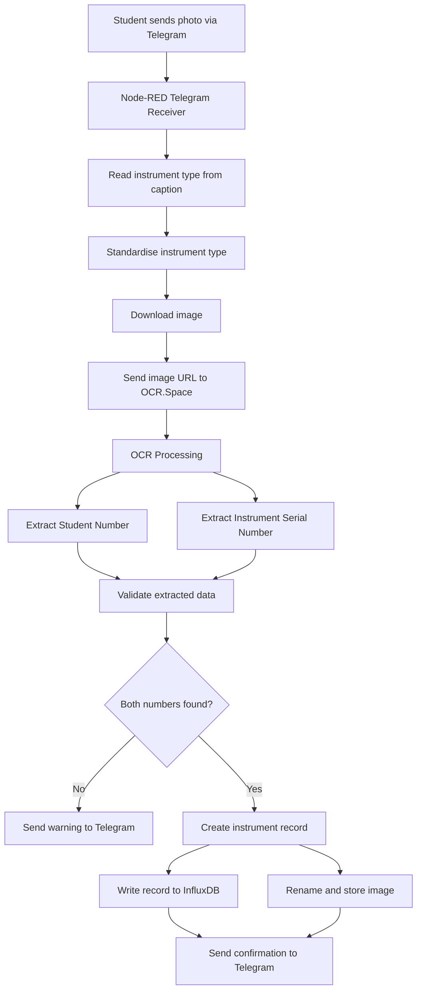

# Ergos Instrument Tracking System

A Telegram- and Node-RED-based instrument tracking system developed for the **Ergos Project**.

The system allows students to photograph an instrument and its identifying information, after which the image is processed automatically using OCR. The extracted **student number** and **instrument serial number**, together with the **instrument type**, are stored in InfluxDB for tracking and record-keeping.

The system is designed to reduce manual data capture when instruments are issued to and returned by students.

---

## Overview

The workflow uses:

* **Telegram** — user interface for submitting photographs
* **Node-RED** — workflow orchestration and data processing
* **OCR.Space API** — optical character recognition
* **InfluxDB** — storage of instrument allocation records
* **Linux file system** — storage of processed images

A student sends a photograph through Telegram. The system extracts the student number and instrument serial number from the image, determines the instrument type from the Telegram caption, and stores the resulting record in InfluxDB.

---

## System Workflow



---

## How It Works

### 1. Submit an image through Telegram

The student sends a photograph to the Telegram bot.

The photograph should contain the identifying information required by the OCR process, including:

* Student number
* Instrument serial number

The instrument type can be provided in the Telegram caption.

Example:

```text
red light
```

The system currently recognises several instrument types, including:

```text
red_light
red_sound
red_temp_hum
blue_light
blue_sound
blue_air_velocity
```

---

### 2. Instrument type standardisation

The Node-RED function normalises the caption so that different variations can be interpreted consistently.

For example:

```text
Red Light
red-light
red_light
redlight
```

are interpreted as the same instrument type:

```text
red_light
```

The same approach is used for the other supported instrument categories.

---

### 3. Image download

Node-RED obtains the image URL from Telegram and downloads the image to a temporary directory.

Example:

```text
/data/Ergos/images/incoming/
```

A temporary filename is generated using the Telegram chat ID and timestamp.

---

### 4. OCR processing

The image URL is sent to the **OCR.Space API**.

The OCR response is processed by a Node-RED function that searches for numerical candidates.

The current heuristics assume:

* Student number = **8 digits**
* Instrument serial number = **9 or more digits**

Common OCR errors are also corrected where appropriate, for example:

```text
O → 0
g → 9
b → 8
```

---

### 5. Data validation

The system checks whether both required numbers were successfully extracted.

A successful record contains:

```text
Student number
Instrument serial number
Instrument type
```

If either number cannot be identified, the system does not write the record to InfluxDB. Instead, Telegram returns a message asking the student to submit a clearer photograph.

---

## InfluxDB Storage

Valid records are written to the InfluxDB measurement:

```text
project_instruments
```

The current data structure stores:

### Tag

```text
student number
```

### Fields

```text
instrument serial
instrument type
```

This structure allows the instrument allocation data to be queried and visualised later using tools such as Grafana.

---

## Image Storage

After successful processing, the temporary image is renamed using the extracted identifiers.

The resulting filename follows the format:

```text
<student_number>_<instrument_number>.jpg
```

For example:

```text
12345678_123456789.jpg
```

This provides a direct relationship between the stored image and the corresponding instrument allocation record.

---

## Telegram Feedback

The bot provides feedback throughout the process.

### Successful capture

```text
✅ Captured
Student: 12345678
Instrument: 123456789
Type: red_light

Sending to InfluxDB...
```

After the database write:

```text
✅ Saved to InfluxDB.
```

The image is also renamed using the extracted identifiers.

### Failed OCR

If the required numbers cannot be extracted:

```text
⚠️ Could not capture both numbers.
Student: Not found
Instrument: Not found
Type: red_light

Please send a clearer photo.
```

---

## Technology Stack

| Component  | Purpose                                 |
| ---------- | --------------------------------------- |
| Telegram   | User interface and image submission     |
| Node-RED   | Workflow automation and processing      |
| OCR.Space  | Optical character recognition           |
| InfluxDB   | Instrument tracking database            |
| Linux      | Image storage and execution environment |
| JSON       | Node-RED flow configuration             |
| JavaScript | Data processing and validation          |

---

## Node-RED Flow Structure

The main processing pipeline consists of the following stages:

```text
Telegram Receiver
       ↓
Instrument Type Standardisation
       ↓
Image Download
       ↓
OCR.Space
       ↓
OCR Parsing
       ↓
Student + Instrument Number Extraction
       ↓
Validation
       ↓
 ┌─────┴─────┐
 ↓           ↓
Invalid     Valid
 ↓           ↓
Telegram    InfluxDB
Warning       +
             Image Storage
               ↓
          Telegram Confirmation
```

---

## Error Handling

The flow includes handling for several failure conditions:

* Missing or unreadable student number
* Missing or unreadable instrument serial number
* OCR extraction failure
* InfluxDB write failure
* Image rename failure
* Invalid image data

When possible, errors are communicated back to the user through Telegram rather than silently failing.

---

## Project Purpose

The system was developed to assist with the management of instruments issued to students for practical coursework.

Instead of manually recording each instrument allocation, the workflow provides a lightweight automated process:

```text
Photograph
    ↓
OCR
    ↓
Identification
    ↓
Database Record
    ↓
Traceable Image
```

This reduces repetitive manual data entry and creates a digital record that can be used for subsequent instrument tracking and reconciliation.

---

## Future Improvements

Potential future improvements include:

* Support for multiple photographs per submission
* Improved OCR validation using known serial-number formats
* Automatic detection of instrument type from the photograph
* Student-number validation against a student database
* Automatic tracking of instrument issue and return events
* Grafana dashboard for instrument availability
* Search functionality through Telegram
* Automatic identification of overdue instruments
* Improved handling of multiple instruments in one submission

---

## Repository Structure

A suggested repository structure is:

```text
ergos-instrument-tracking/
│
├── README.md
│
├── node-red/
│   └── instrument_tracking_flow.json
```

---

## Security Note

The Node-RED flow communicates with external services and may contain credentials such as API keys or database connection information.

**Do not commit API keys, Telegram bot tokens, InfluxDB tokens, passwords, or other credentials to GitHub.**

Before uploading the flow, replace credentials with placeholders or configure them through environment variables / Node-RED credentials.

For example:

```javascript
const OCR_APIKEY = process.env.OCR_APIKEY;
```

Sensitive configuration should be kept outside the publicly accessible repository.

---

## Author

Developed as part of the **Ergos Project** to automate student instrument tracking and reduce manual data capture.
